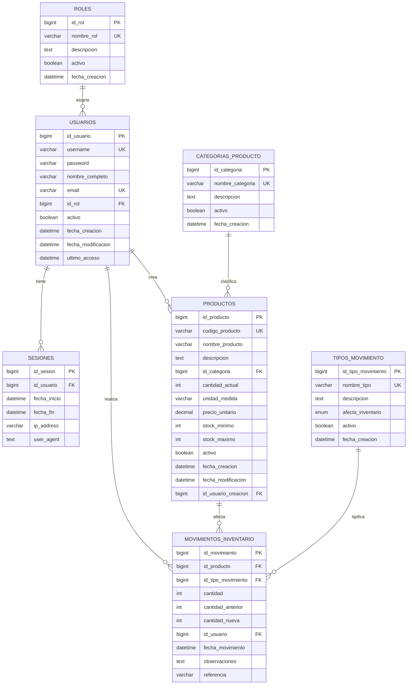

# 🏪 Sistema de Inventario Castores

Sistema de gestión de inventario completo con autenticación JWT, control de roles y seguimiento de movimientos de productos.

## 📋 Tabla de Contenido

- [Requisitos del Sistema](#requisitos-del-sistema)
- [Tecnologías Utilizadas](#tecnologías-utilizadas)
- [Diagrama Entidad-Relación](#diagrama-entidad-relación)
- [Configuración del Entorno](#configuración-del-entorno)
- [Instrucciones de Instalación](#instrucciones-de-instalación)
- [IDE y Extensiones Recomendadas](#ide-y-extensions-recomendadas)
- [Cómo Ejecutar el Proyecto](#cómo-ejecutar-el-proyecto)
- [Estructura del Proyecto](#estructura-del-proyecto)
- [Documentación de la API](#documentación-de-la-api)
- [Troubleshooting](#troubleshooting)

## 🖥️ Requisitos del Sistema

### Software Base
- **Java 21+** (JDK/OpenJDK)
- **Maven 3.8+**
- **MySQL 8.0+**
- **Git**

### Requisitos de Hardware
- **RAM**: 4GB mínimo (8GB recomendado)
- **Almacenamiento**: 2GB de espacio libre
- **Procesador**: Dual-core mínimo

## 🛠️ Tecnologías Utilizadas

### Backend
- **Spring Boot 4.0.2** - Framework principal
- **Spring Security 7.0.3** - Autenticación y autorización
- **Spring Data JPA** - Acceso a datos
- **Hibernate 7.2.1** - ORM
- **MySQL Connector** - Base de datos
- **JWT** - Tokens de autenticación
- **Spring Boot DevTools** - Desarrollo

### Base de Datos
- **MySQL 8.0** - Motor principal
- **HikariCP** - Pool de conexiones

## 📊 Diagrama Entidad-Relación



## ⚙️ Configuración del Entorno

### 1. Instalar Java 21
```bash
# Ubuntu/Debian
sudo apt update
sudo apt install openjdk-21-jdk

# macOS (con Homebrew)
brew install openjdk@21

# Windows
# Descargar desde https://adoptium.net/
```

### 2. Configurar JAVA_HOME
```bash
# Agregar a ~/.bashrc o ~/.zshrc
export JAVA_HOME=/usr/lib/jvm/java-21-openjdk-amd64
export PATH=$PATH:$JAVA_HOME/bin
```

### 3. Instalar Maven
```bash
# Ubuntu/Debian
sudo apt install maven

# macOS
brew install maven

# Windows
# Descargar desde https://maven.apache.org/
```

### 4. Configurar MySQL
```bash
# Iniciar MySQL
sudo systemctl start mysql

# Crear base de datos
mysql -u root -p
CREATE DATABASE castores_db CHARACTER SET utf8mb4 COLLATE utf8mb4_unicode_ci;
CREATE USER 'castores_user'@'localhost' IDENTIFIED BY '12345678';
GRANT ALL PRIVILEGES ON castores_db.* TO 'castores_user'@'localhost';
FLUSH PRIVILEGES;
```

## 💻 IDE y Extensiones Recomendadas

### Visual Studio Code (Recomendado)
#### Extensiones Esenciales
- **Extension Pack for Java** (Microsoft) - v0.25.0+
- **Spring Boot Extension Pack** (Microsoft) - v1.28.0+
- **MySQL** (cweijan) - v0.8.0+
- **REST Client** (Huachao Mao) - v0.25.0+

#### Extensiones de Productividad
- **GitLens** (GitKraken) - v14.0.0+
- **Thunder Client** (Ranga Vadhineni) - v1.13.0+
- **Mermaid Preview** (bierner) - v3.4.0+
- **SonarLint** (SonarSource) - v4.4.0+

#### Extensiones de Calidad de Código
- **Checkstyle for Java** (ShengChen) - v12.0.0+
- **PMD** (SonarSource) - v0.7.0+

### IntelliJ IDEA Ultimate (Alternativa)
- **Spring Boot** Plugin (integrado)
- **Database Navigator** Plugin
- **REST Client** Plugin (integrado)

### Eclipse (Alternativa)
- **Spring Tools 4** Plugin
- **M2Eclipse** (integrado)
- **Data Tools Platform** Plugin

## 🚀 Instrucciones de Instalación

### 1. Clonar el Repositorio
```bash
git clone <URL_DEL_REPOSITORIO>
cd API_CASTORES/castores
```

### 2. Configurar Variables de Entorno
```bash
# Copiar el archivo de propiedades
cp src/main/resources/application.properties.example src/main/resources/application.properties

# Editar las propiedades según tu configuración
nano src/main/resources/application.properties
```

### 3. Compilar el Proyecto
```bash
mvn clean compile
```

### 4. Ejecutar Tests (opcionales)
```bash
mvn test
```

## ▶️ Cómo Ejecutar el Proyecto

### Método 1: Maven (Recomendado para desarrollo)
```bash
# Desde la raíz del proyecto
mvn spring-boot:run
```

### Método 2: Java Directo
```bash
# Compilar y crear JAR
mvn clean package

# Ejecutar JAR
java -jar target/sistema-inventario-1.0.0.jar
```

### Método 3: IDE
1. **Importar como proyecto Maven**
2. **Ejecutar clase principal**: `com.inventario.sistema.SistemaInventarioApplication`
3. **Abrir en navegador**: http://localhost:8080/api

### Verificar Instalación
La aplicación debería mostrar:
```bash
2024-01-01 12:00:00.000  INFO 12345 --- [           main] c.i.s.SistemaInventarioApplication       : Started SistemaInventarioApplication
2024-01-01 12:00:00.000  INFO 12345 --- [           main] o.s.boot.tomcat.TomcatWebServer          : Tomcat started on port 8080
```

## 📁 Estructura del Proyecto

```
src/main/java/com/inventario/sistema/
├── 📂 config/                  # Configuración principal
│   ├── SecurityConfig.java
│   ├── GlobalExceptionHandler.java
│   └── DataInitializer.java
├── 📂 controller/              # Controladores REST
│   ├── AuthController.java
│   ├── ProductoController.java
│   ├── InventoryController.java
│   ├── MovimientoController.java
│   └── HistorialMovimientosController.java
├── 📂 dto/                     # Data Transfer Objects
│   ├── LoginDTO.java
│   ├── AuthResponseDTO.java
│   ├── ProductoCreateDTO.java
│   ├── ProductoResponseDTO.java
│   └── MovimientoDTO.java
├── 📂 entity/                  # Entidades JPA
│   ├── Usuario.java
│   ├── Rol.java
│   ├── Producto.java
│   ├── MovimientoInventario.java
│   ├── TipoMovimiento.java
│   └── CategoriaProducto.java
├── 📂 repository/               # Interfaces Spring Data
│   ├── UsuarioRepository.java
│   ├── ProductoRepository.java
│   ├── MovimientoInventarioRepository.java
│   └── ...
├── 📂 security/                # Configuración de seguridad
│   ├── JwtService.java
│   ├── JwtAuthenticationFilter.java
│   └── CustomUserDetailsService.java
├── 📂 service/                 # Lógica de negocio
│   ├── AuthenticationService.java
│   ├── ProductoService.java
│   ├── InventoryService.java
│   └── UsuarioService.java
└── 📂 SistemaInventarioApplication.java  # Clase principal
```

## 📚 Documentación de la API

### Documentación Completa
Ver archivo: **[API_DOCUMENTATION.md](./API_DOCUMENTATION.md)**

### Endpoints Principales
- **Autenticación**: `/api/auth/**`
- **Productos**: `/api/productos/**`
- **Inventario**: `/api/inventario/**`
- **Movimientos**: `/api/inventario/movimientos/**`
- **Historial**: `/api/inventario/historial/**`

### Ejemplo de Uso
```bash
# 1. Login para obtener token
curl -X POST http://localhost:8080/api/auth/login \
  -H "Content-Type: application/json" \
  -d '{"username":"admin","password":"123456"}'

# 2. Ver productos activos
curl -X GET http://localhost:8080/api/inventario/productos/activos \
  -H "Authorization: Bearer <TOKEN>"

# 3. Agregar entrada al inventario
curl -X POST http://localhost:8080/api/inventario/movimientos/entrada \
  -H "Content-Type: application/json" \
  -H "Authorization: Bearer <TOKEN>" \
  -d '{"productoId":1,"cantidad":10,"usuarioId":1,"observaciones":"Entrada inicial"}'
```

## 🔧 Troubleshooting

### Problemas Comunes

#### 1. Puerto 8080 en uso
```bash
# Ver qué proceso usa el puerto
lsof -i :8080

# Matar proceso
kill -9 <PID>

# O cambiar puerto en application.properties
server.port=8081
```

#### 2. Error de conexión a MySQL
```bash
# Verificar que MySQL esté activo
sudo systemctl status mysql

# Probar conexión manual
mysql -u castores_user -p castores_db

# Revisar permisos en application.properties
spring.datasource.url=jdbc:mysql://localhost:3306/castores_db?useSSL=false&serverTimezone=America/Mexico_City&allowPublicKeyRetrieval=true
```

#### 3. Error de JAVA_HOME
```bash
# Verificar Java
java -version

# Verificar JAVA_HOME
echo $JAVA_HOME

# Configurar correctamente
export JAVA_HOME=$(dirname $(dirname $(readlink -f $(which java))))
```

#### 4. Errores de compilación Maven
```bash
# Limpiar y recompilar
mvn clean compile

# Forzar descarga de dependencias
mvn dependency:resolve

# Saltar tests si fallan
mvn package -DskipTests
```

### Logs y Depuración

#### Logs de la Aplicación
```bash
# Ver logs en tiempo real
tail -f logs/application.log

# Logs con nivel DEBUG
mvn spring-boot:run -Dspring-boot.run.jvmArguments="-Dlogging.level.root=DEBUG"
```

#### Logs de MySQL
```bash
# Habilitar logs en my.cnf
[mysqld]
general_log=1
general_log_file=/var/log/mysql/mysql.log
```

### Rendimiento y Optimización

#### Optimización JVM
```bash
# Configurar memoria para producción
export JAVA_OPTS="-Xms512m -Xmx2048m -XX:+UseG1GC"

# Para desarrollo
export JAVA_OPTS="-Xms256m -Xmx1024m"
```

#### Optimización de MySQL
```sql
-- Optimizar para Spring Boot
SET GLOBAL innodb_buffer_pool_size = 1073741824; -- 1GB
SET GLOBAL innodb_log_file_size = 268435456; -- 256MB
SET GLOBAL query_cache_size = 67108864; -- 64MB
```

## 📞 Soporte

### Contacto
- **Email**: support@castores.com
- **GitHub Issues**: [Crear issue en repositorio]

### Recursos
- **Documentación Spring Boot**: https://spring.io/projects/spring-boot
- **Documentación JPA**: https://spring.io/projects/spring-data-jpa
- **MySQL Documentation**: https://dev.mysql.com/doc/

---

## 📜 Licencia

Copyright © 2024 Sistema Castores. Todos los derechos reservados.